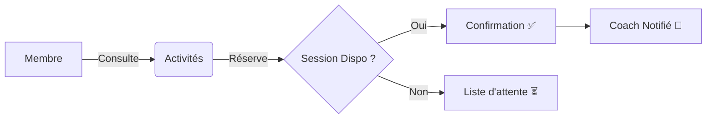

# 🚀 Système de Réservation

## 🌟 Présentation
Ce projet est une plateforme **interactive** de gestion de réservations. Il centralise la planification entre :
- 👥 **Membres** (en quête de sport)
- 🧠 **Coachs** (experts passionnés)
- 🏋️ **Activités** (du débutant au pro)

## 🔄 Flux de l'Application

## 🛠️ Structure
- 📂 `src/` : Le cerveau de l'app.
- 🎨 `templates/` : L'interface utilisateur (Twig).
- 🏗️ `migrations/` : L'évolution de la base de données.
