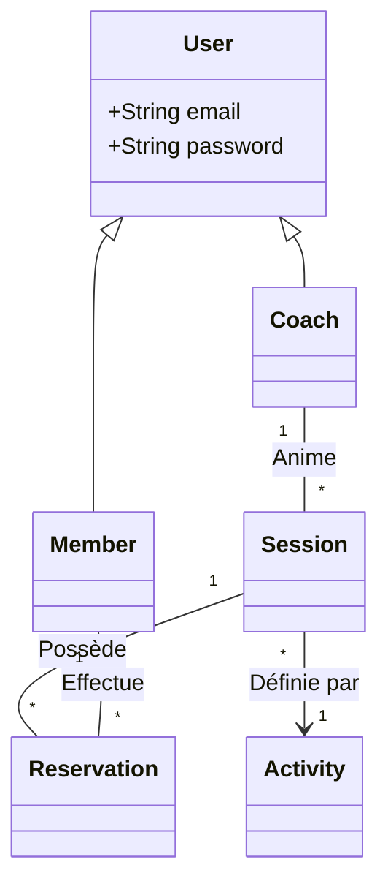

# ⚙️ Architecture Technique

## 🏗️ Modèle de Données (UML)

## 🛠️ Stack Technologique
- **Framework** : `Symfony 6.4` 🚀
- **ORM** : `Doctrine` (avec Lazy Loading activé)
- **Sécurité** : `Authenticator Manager` (JWT/Session)
- **Assets** : `AssetMapper` (No-Node architecture) ⚡

## 📡 Pipeline de Déploiement
1. **Linting** : `php-cs-fixer`
2. **Static Analysis** : `PHPStan`
3. **Tests** : `PHPUnit` 🧪
4. **Deploy** : `Docker Stack`

## 🔒 Sécurité
Les rôles sont hiérarchisés dans `security.yaml` :
- `ROLE_ADMIN` > `ROLE_COACH` > `ROLE_USER`

---
*Document généré automatiquement le 30 Janvier 2026*
